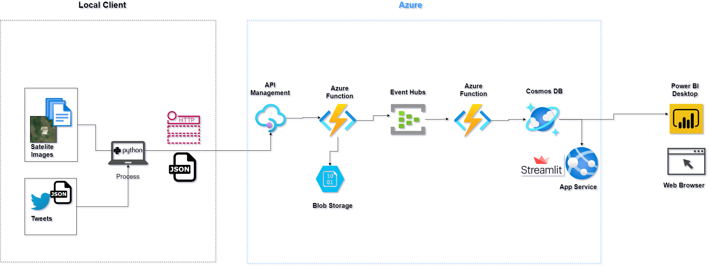
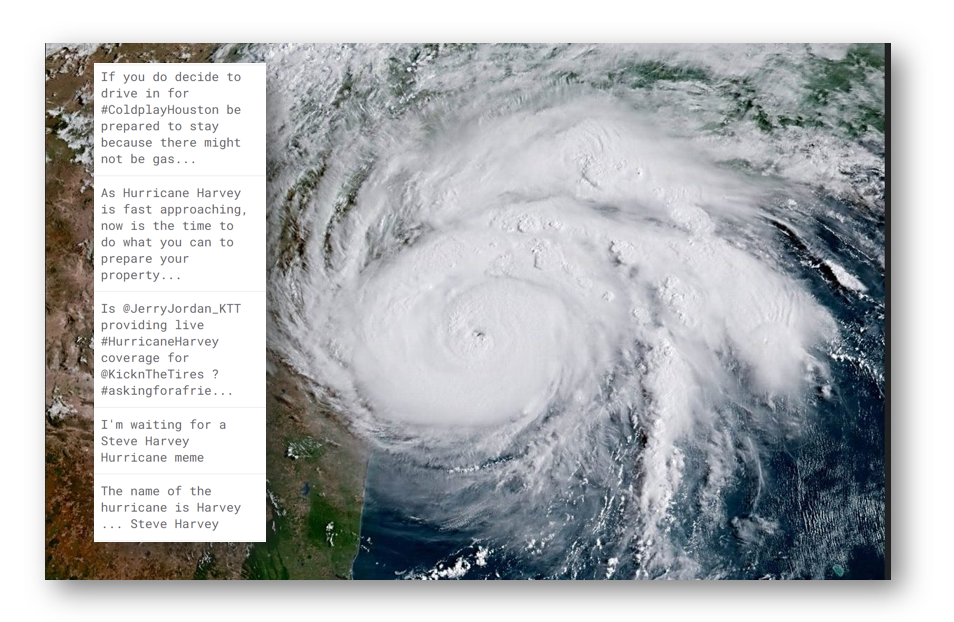
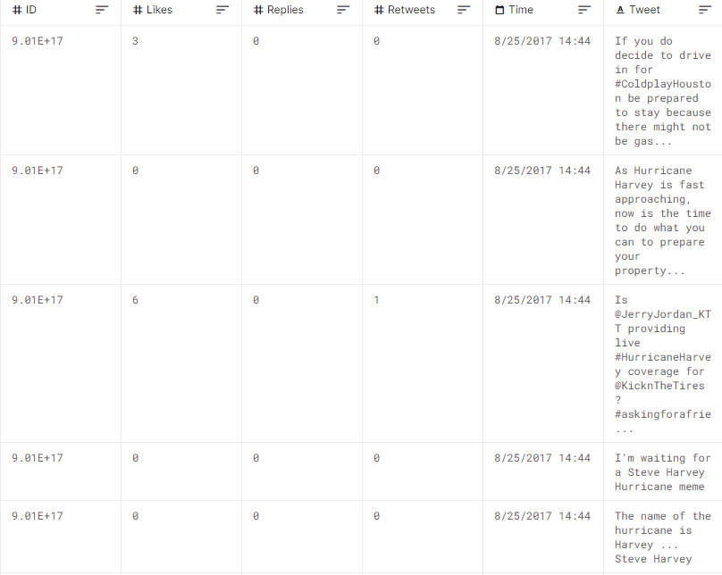
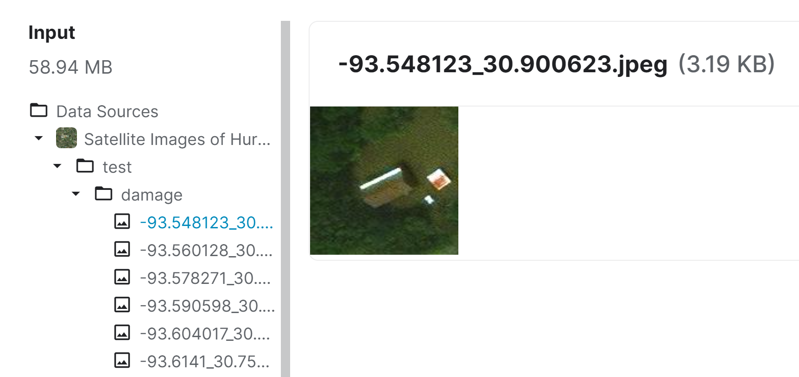

> The Main goal of this post is to introduce an Azure Data Engineering Project where I will prototype streaming and batch processing data pipelines, with the main purpose to ingest and process data that consists of tweets and satellite images extracted from Kaggle datasets.

Personal motivation for this project is to explore Azure in the light of data engineering and its service offerings.

<!--truncate-->

## Introduction

The upcoming posts will consist of writing about:

  - Python functions and modules that process the data from Kaggle, combine tweets and satelite images into a single file acting as a source of streaming data, and building a python program that will send requests to an Azure API endpoint. 

  -  Azure streaming data pipeline that:
       - Ingests tweets from the local source client via Azure API management having an Azure Function as a backend.
       - Utilizes Azure Event Hub as a message queue service.
       - Azure Function that takes messages from Azure Event Hub and writes them to Azure Cosmos Database.
  
       - 

  - Azure batch data pipeline that will take daily tweets in a form of csv reports, process them and store them to the same serving data store, Azure Cosmos Database.

  - Python Streamlit Web App (acting as a prototype) that sources data from Cosmos DB, and visualises it in a set of insightful charts. It will be deployed on Azure Web App Service. 

## Data

Data for the project consists of:

- [Hurricane Harvey Tweets](https://www.kaggle.com/dan195/hurricaneharvey) from Kaggle.
- [Satellite Images of Hurricane Damage](https://www.kaggle.com/kmader/satellite-images-of-hurricane-damage) from Kaggle

:::note
 Since there is no apparent real relation in the data between tweets and satelite images, for this project, I decided to mock the relation and randomly assign ids from images to tweets to create an artificial relationship.
:::

### Hurricane Harvey Tweets

Tweets containing Hurricane Harvey which spans from morning of 8/25/2017 to 8/30, as well as the properly merged version of the dataset including Tweets from when Harvey before it was downgraded back to a tropical storm.

The dataset has 7 columns, of which the first is just the index. The rest are as follows...

  - **ID** - Twitter ID

  - **Time** - Datetime stamp of tweet
   
  - **Tweet** - Text content of tweet
 
  - **Retweets** - Number of retweers
 
  - **Replies** Number of replies to a given tweet
 
  - **Likes** Number of likes of a given tweet

Example of the table:

### Satellite Images of Hurricane Damage

The data are satellite images from Texas after Hurricane Harvey divided into two groups (damage and no_damage). 

Source: Data is originally taken from: https://ieee-dataport.org/open-access/detecting-damaged-buildings-post-hurricane-satellite-imagery-based-customized and can be cited with http://dx.doi.org/10.21227/sdad-1e56 and the original paper is here: https://arxiv.org/abs/1807.01688

Example of an image, and the directories together with the image files:

## In the Next Post...

In the next post, I will introduce Python functions and modules that process the data from Kaggle, combine tweets and satellite images into a single json file acting as a source of streaming data, and building a python program that will send requests to an Azure API endpoint, where each request will be a single tweet with a predefined schema. 

