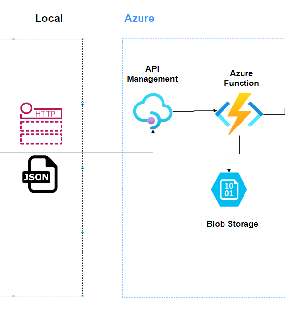
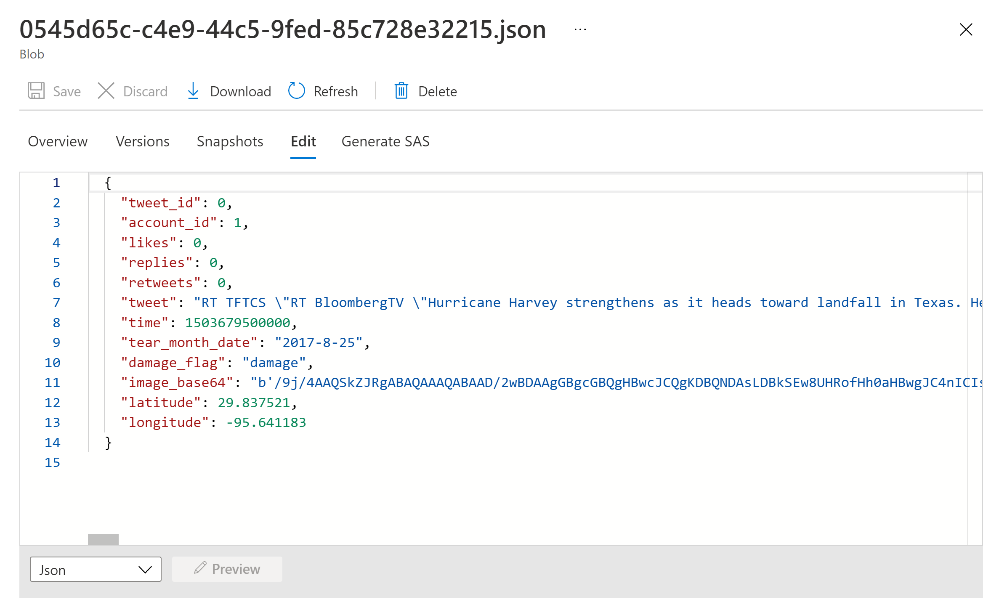

> In this post, I will explain how I created the first part of the data streaming pipeline which has an API gateway that will accept API calls (with tweet messages) and route them to the Azure Function, that further processes the data and (initially) store them to Azure Blob Storage.

<!--truncate-->


## Introduction

Now that we have the data in the desired format and with the relevant content, we can embark in the world of Azure where we will select a suite of services that will assist us in reaching our goal, and that is to build a data streaming pipeline.

In this blog post I will describe the following three Azure services (see also the diagram below):


- [Azure API Management](https://docs.microsoft.com/en-us/azure/api-management/api-management-key-concepts)

- [Azure Functions](https://docs.microsoft.com/en-us/azure/azure-functions/functions-overview)

- [Azure Key Vault](https://docs.microsoft.com/en-us/azure/key-vault/general/overview) 

- [Azure Blob Storage](https://docs.microsoft.com/en-us/azure/storage/blobs/storage-blobs-introduction) 



Figure 1: Diagramme of the data preparation process.

# Step 1 - Azure API Management

As explained in the official Microsoft's docs, API Management (APIM) is a way to create consistent and modern API gateways for existing back-end services.

My API gateway in APIM:

- had a single API endpoint that would accept API calls (requests with tweet messages)
- API references to the back-end Function App which I previously already  had to create, for it to be accessible when I add an API in APIM
- single POST operation mapped to the operation implemented in the backend Function App service that was written in Python.

Settings in the API were configured as follows:


What is important to notice that `Subscription Required` is toggled on.
When you publish APIs through API Management, it's easy and common to secure access to those APIs by using subscription keys, which I immediately did leave as it was by default - with subscription required.

To consume the published API, I now have to include a valid subscription key in the HTTP requests header when I make calls to the created API. Otherwise, the calls are rejected immediately by the API Management gateway. They aren't forwarded to the back-end services.

In addition to the subscription key required, I wanted to check out and test Policies which are a powerful capability of the Azure API Management (APIM) that allows the publisher to change the behaviour of the API through configuration. APIM policy is a collection of statements executed sequentially on the request or response of an API. We can define our policy statement in four configuration sections: inbound, backend, outbound, and on-error. It is nicely explained here by 

As he wrote in the post, although we can think of Basic authentication as a legacy, there are still companies who are using this authentication mechanism, mostly because of its simplicity and legacy software base. 

The following is the overview of the steps I did to enable a Basic Authentication policy together with all necessary steps:

1) Enabled managed identity for API management.
2) Created a Key Vault in Azure.
   
3) Enabled access to the key vault secrets from API management.
4) Added demoUserName and demoUserPassword as keys, and values as actual username and passwords.
5) Create a Named value in the API Management with the Key Vault URL, password and username.
   
6) In the inbound part of your Policy definition, added the following code:
        
        ```
        <policies>
            <inbound>
                <base />
                <choose>
                    <when condition="@(context.Request.Headers.     GetValueOrDefault("Authorization").AsBasic().UserId!="{     {username}}" || context.Request.Headers.GetValueOrDefault  ("Authorization").AsBasic().Password!="{{password}}")">
                        <return-response>
                            <set-status code="401" reason="Not authorized" />
                        </return-response>
                    </when>
                </choose>
                <set-header name="Authorization" exists-action="delete" />
            </inbound>
            <backend>
                <base />
            </backend>
            <outbound>
                <base />
            </outbound>
            <on-error>
                <base />
            </on-error>
        </policies>
        ```  

7) Tested with a request containing the following header (it was within the Test API part of the APIM on Azure portal so Ocp-Apim-Subscription-Key: •••••••••••••••••••••••••••••••• was added automatically if toggled on in the settings): 

    `Authorization Basic <Base64 representation of the combination username:password>`

   - HTTP triggered Azure function was executed successfully with a 200 OK status.


Now that I have a double secure way of consuming created API, let us rewind a bit, and go to a prerequisite and that is creating an Azure Function that will act as a backend and have bindings to Azure Blob Storage and Azure Events Hub.

## Step 2 - (or step 0 actually) - Azure Function(s)

Azure Function App consists of two Azure Functions as a part of an Azure streaming data pipeline:

1) Azure Function in our case is acting as a backend in Azure API management and is consuming POST requests with tweet messages. In the function logic, it checks for validity and conformity of the JSON messages to a predefined JSON schema, and if valid, it passes the JSON onwards to Azure Event Hubs and writes them to Azure Blob Storage as JSON files.

    `./HttpTriggerTweetToBlobAndEventHub`

   

I will not go into details of the development environment (Locally developed on WSL2 with Ubuntu 20.04 via Visual Studio Code and its plugins for Azure Services), and Python code itself since it is anyway very simple.

The function has two validation steps:

1) Python logic to check if valid JSON was sent via HTTP request, if invalid, it raises an exception with an appropriate message and status code to the sender client.

2) Check if the JSON message is conforming to the predefined JSON schema:

```
tweet_schema = {
    # "$schema": "http://json-schema.org/draft-04/schema#",
    "type": "object",
    "properties": {
        "tweet_id": {
            "type": "integer"
        },
        "account_id": {
            "type": "integer"
        },
        "likes": {
            "type": "integer"
        },
        "replies": {
            "type": "integer"
        },
        "retweets": {
            "type": "integer"
        },
        "tweet": {
            "type": "string"
        },
        "time": {
            "type": "integer"
        },
        "tear_month_date": {
            "type": "string"
        },
        "damage_flag": {
            "type": "string"
        },
        "image_base64": {
            "type": "string"
        },
        "latitude": {
            "type": "number"
        },
        "longitude": {
            "type": "number"
        }
    },
    "required": [
        "tweet_id",
        "account_id",
        "likes",
        "replies",
        "retweets",
        "tweet",
        "time",
        "tear_month_date",
        "damage_flag",
        "image_base64",
        "latitude",
        "longitude"
    ]
}
```

## Step 3 - Write messages to Azure Blob Storage

If an incoming JSON  request was accepted by API in Azure APIM, and if Azure Function validated the body of the tweet message successfully I decided to initially test writing successful messages with the Azure Function bindings towards the Azure Blob Storage.

For the ones that are not familiar with the binding in Azure Functions, [binding](Binding to a function is a way of declaratively connecting another resource to the function; bindings may be connected as input bindings, output bindings, or both. Data from bindings is provided to the function as parameters.) to a function is a way of declaratively connecting another resource to the function; bindings may be connected as input bindings, output bindings, or both. Data from bindings are provided to the function as parameters.

This is how my binding is defined in the Azure Function bindings definition:

```
   {
      "type": "blob",
      "direction": "out",
      "name": "outputBlob",
      "path": "output/{rand-guid}.json",
      "connection": "AzureWebJobsStorage"
    },
```

It is obvious that after successfully sending an x number of HTTP requests with tweets to an API endpoint, and thus to Azure function backend, all messages were successfully written as JSON files with a rand-guid id as the filename.

  

This is the content of one example tweet opened directly in blob storage:

 

## In the Next Post...

We now have a secure functioning API endpoint that accepts valid and well-defined tweet messages sent as HTTP POST requests, and the body of requests are successfully being written to Azure blob storage as JSON files.

In the next post, I will introduce and create the following Azure Services:

  - [Azure Event Hubs](https://docs.microsoft.com/en-us/azure/event-hubs/event-hubs-about)

  - [Azure Cosmos DB](https://docs.microsoft.com/en-us/azure/cosmos-db/introduction) - SQL Core - Document Store

The main goal will be to have Azure Event Hubs as a big data streaming platform and event ingestion service which can receive and process millions of events per second (not our case but it has the possibility), and also store the messages into Azure Cosmos DB's, a SQL Core - Document Store, which purpose is to act as a fully managed NoSQL database. 