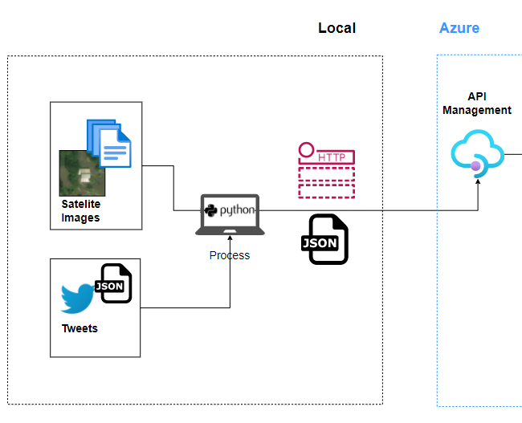
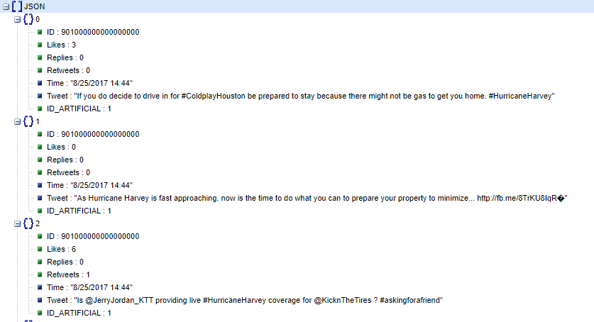
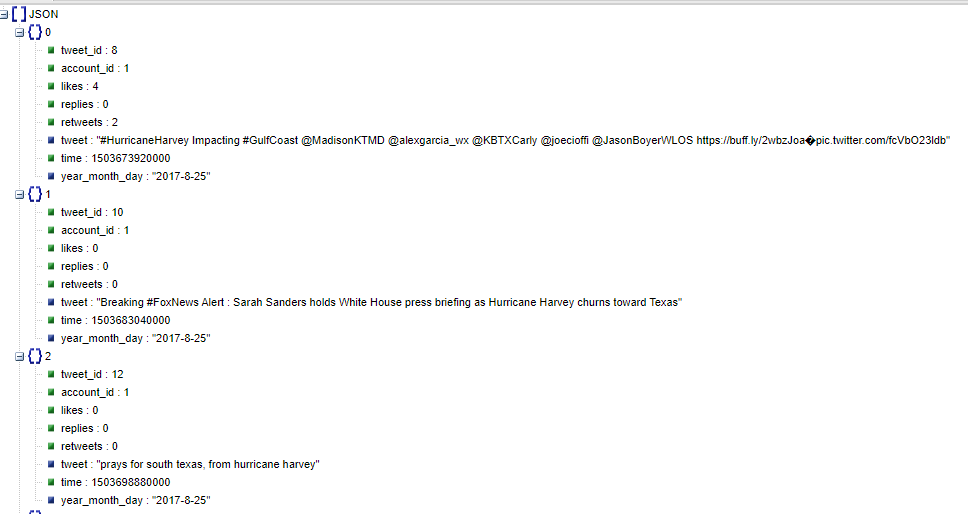
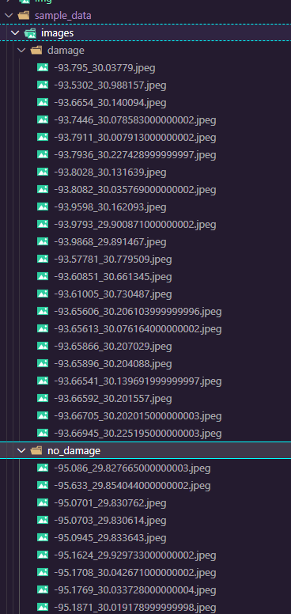
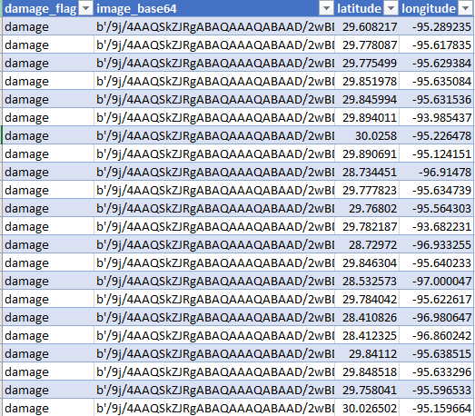
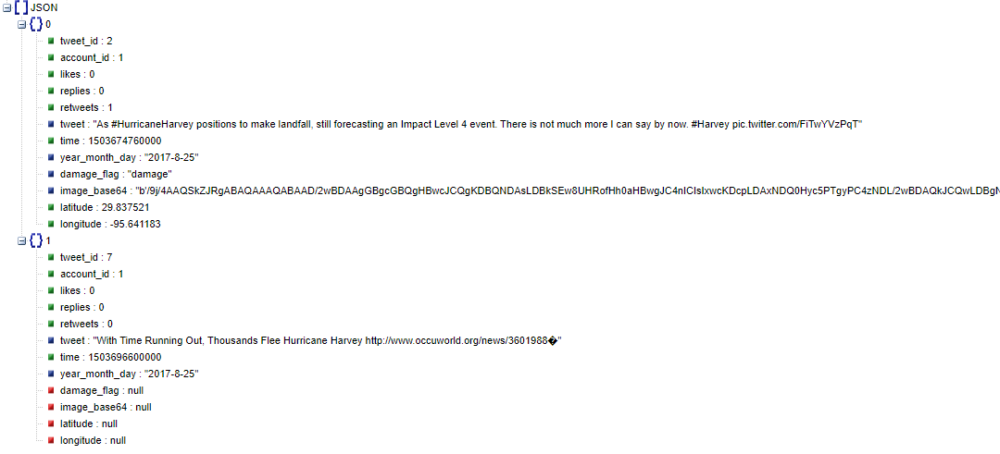

> In this post I will briefly introduce Python functions and scripts that process the data from Kaggle, combine tweets and satellite images into a single file, acting as source data, and building a python program that will send requests to an Azure API endpoint. 

<!--truncate-->


:::note
Since there is no real relation between tweets and satellite images, for creating data pipelines in Azure, I have simulated and randomly assigned ids from images to tweets, and thus made an artificial relation.
:::


## Introduction

I have briefly introduced the data sources in the [previous post](./2021-02-28-data-engineering-part1.md) so I will skip the introduction of the datasets here. In figure 1, there is a high-level overview of what are the inputs and what are the outputs of the data processing, with the main aim of generating a JSON file that contains messages which I will send via HTTP requests to the Azure API Management API endpoint.


Figure 1: Diagramme of the data preparation process.


## Python Scripts

[Github Project](https://github.com/baky0905/hurricane-proc-send-data) has four python files. They can each be tested locally on a sample dataset that is contained in the repository under [./sample_data](https://github.com/baky0905/hurricane-proc-send-data/sample_data), otherwise, navigate to original data sources and get the full datasets.


###  preprocess_twitter.py

> Script that processes original tweet messages.

**Before processing:**



**After processing:**



###  preprocess_images.py

> Script that processes file paths and names into an attribute table, together with a column that contains base64 encoded images.




**After processing:**



  
### merge_tweets_images.py

> Script that merges processed tweet JSON and images into a single JSON file where images are base 64 encoded.

**After merging processed tweets and images:**


  
### `push_tweets.py`

>> Script converted to Python CLI via [Python Fire](https://google.github.io/python-fire/). Script sends tweet records from JSON file as requests with a predefined header and schema. 

**When in the CLI, type (number 5 is an argument for a number of tweets you would like to send towards REST API endpoint):**

```sh
python3 src/push_tweets.py send_tweets_to_rest_api 5
```

**To send 5 tweet messages, one by one to a defined REST API endpoint in Azure.**


## In the Next Post...

Now that we have the required data in the desired shape, format and content, we can proceed to design a data streaming pipeline in Azure.

The goal will be to create the first part of the data streaming pipeline which consists of an API gateway accepting API calls and routing them to the Azure function that processes the data and (initially) stores them to Azure Blob Storage.

In the next post, I will introduce and create the following Azure Services:

- [Azure API Management](https://docs.microsoft.com/en-us/azure/api-management/api-management-key-concepts)

- [Azure Functions](https://docs.microsoft.com/en-us/azure/azure-functions/functions-overview)

- [Azure Blob Storage](https://docs.microsoft.com/en-us/azure/storage/blobs/storage-blobs-introduction) 
